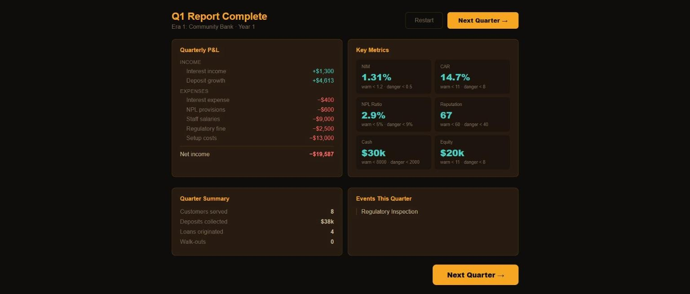
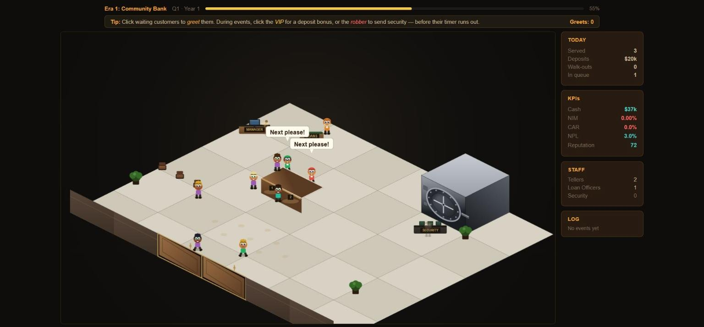
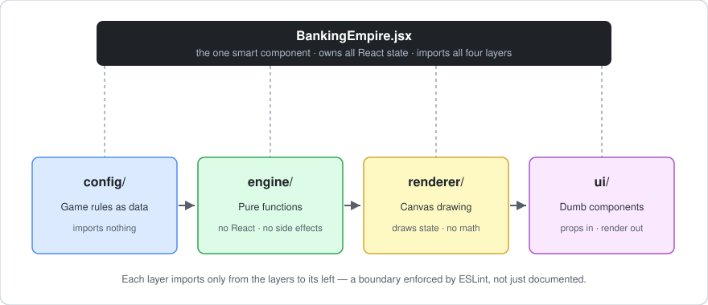

# Banking Empire

<p align="center">
  <a href="https://dhoovdb.github.io/banking-empire/">
    
  </a>
</p>

A browser-based banking simulation game built to teach core financial concepts
through play. Manage a community bank across 20 quarters — set interest rates,
hire staff, and handle crises — while keeping your regulators happy and your
depositors happier.

Built by an AI Product Manager who used to work in fintech and wanted to
understand React architecture better.

---

## Play it

**[https://dhoovdb.github.io/banking-empire/](https://dhoovdb.github.io/banking-empire/)**

**Playable today:**

- **Era 1: Community Bank** — Learn why NIM, CAR, and NPL are the three numbers that keep a real bank alive
- **Era 2: Regional Bank** — Staff up against robberies and inspections, invest in vault security and waiting capacity, and hold liquidity above the floor as the bank scales

**On the roadmap** (designed, not yet shipped — see `ROADMAP.md`):

- **Federal Reserve rate decisions** — time your response to macro rate moves before the market forces a default outcome
- **Era 3: Commercial Bank** — survive a recession and judge whether the acquisition opportunity is worth the integration risk
- **Era 4: National Bank** — manage institutional depositor concentration without becoming the systemic risk the Fed has to bail out

---

## Running locally

```bash
git clone https://github.com/dhoovDB/banking-empire
cd banking-empire
npm install
npm run dev
```

Then open http://localhost:5173 in your browser. Node 18+ required.

---

## One quarter, start to finish

**1 · Set your rates and staff the branch.**


Every hire is a quarterly salary you have to earn back. The reference table below
the controls tells you what each number means and what counts as dangerous —
before you commit, not after.

**2 · The quarter plays out on the floor.**


Customers queue, take a seat, get served, or give up and walk out — you watch it
happen. Here a regulator arrives mid-quarter. Serve the inspector and the fine
goes away. Ignore them and it doesn't.

**3 · The numbers judge you.**



The inspection went unserved, so a $2,500 fine lands on the P&L and reputation
drops from 72 to 67. Era 1 NIM sits at 1.31% because deposits cost money before
the loan book is big enough to pay for them. That's the first lesson, and the
game is built to make you feel it rather than read it.

---

## What you'll learn

By the end of a 20-quarter playthrough you should be able to explain:

- Why **Net Interest Margin** is a bank's core profit engine and how deposit
  volume compresses it even when your rate spread looks healthy
- Why **Capital Adequacy Ratio** matters to regulators and what happens when
  it falls below 8%
- How **reserve requirements** work in practice — and why running out of
  liquidity is a game-over condition even if you're technically profitable

Planned lessons as the roadmap lands:

- What a **bank run** exploits, and why reputation is a balance sheet item
- How **Federal Reserve rate decisions** propagate through a bank's P&L,
  and why the timing of your response matters

The game simplifies — it says so in the UI. Each educational note links to a
primary source if you want the real version.

---

## Architecture

This started as a ~1000-line vibe-coded prototype. The refactor separated
four concerns that were previously tangled together:

<table>
<tr>
<td width="50%" valign="top">

<p align="center"><em>What the player sees</em></p>
</td>
<td width="50%" valign="top">

<p align="center"><em>What's underneath</em></p>
</td>
</tr>
</table>

- **`config/`** — Game rules as data. Rebalancing the game means editing
  config, never the engine.
- **`engine/`** — Pure functions. `calculateNIM()` takes numbers and returns a
  number; `evaluateCharacter()` takes state and returns a command. Nothing in
  the engine calls React.
- **`renderer/`** — Canvas drawing code. `renderFrame()` receives state and
  draws it. It doesn't calculate anything or call `setState`.
- **`ui/`** — React components. Dumb components receive props and render.
  `BankingEmpire.jsx` is the only smart component — it owns state and passes
  callbacks down.

The test for the architecture: adding a new event type means one entry in
`config/events.js`. Adding a new KPI means one entry in `config/economy.js`.
The engine and UI render it automatically.

---

## Key design decisions

See `ROADMAP.md` for the full list. A few worth calling out:

**True NIM, not rate spread.** The original prototype used
`lendingRate - depositRate` as a proxy. The game now uses the correct formula:
`(interest income - interest expense) / loans`. This means NIM can go negative,
and era 1 starts with intentionally low NIM — the player's first job is growing
the loan book relative to deposits. That's the lesson.

**Dynamic reserve requirement.** Game-over liquidity trigger is
`cash < deposits * 0.02` rather than a fixed floor. Forces the player to think
proportionally as the bank scales.

**Concentration risk (designed, shelved for v2).** A whale depositor
representing 20%+ of total deposits should create a structural vulnerability —
their exit triggering a cascade, not just a withdrawal. The mechanic is
designed but was pulled from v1 rather than shipped half-wired; it returns
with the bank-run event in v2. See `ROADMAP.md`.

**Telegraphed macro events (planned).** Fed rate decisions and recessions are
designed to appear as probability indicators before they land, giving the
player one quarter to respond — or the market forces a default outcome.
Inaction is a choice. Designed in `config/events.js`; the engine is not yet
wired.

---

## Built with

- React 18
- HTML5 Canvas (no game engine library — the renderer is ~400 lines of
  hand-written isometric drawing code)
- Vite

---

## What's next

Full roadmap in `ROADMAP.md`. Highlights:

- Era 3 and 4 content — commercial banking, fintech challenger, acquisition events
- Tiered staffing model for era 3+ (regional hubs replace individual tellers)
- Infrastructure assets replacing physical branch upgrades at scale
- KPI history charts so players can see trajectory, not just current state
- Seed-based replays — deterministic playthroughs from a fixed seed (the engine already routes all randomness through one function to make this possible)

---

## Diligence

Built collaboratively with Claude (Anthropic) across multiple sessions. The
architecture, financial model, game design decisions, and all editorial calls
are the author's own. Claude was used as a pair programmer and thinking partner —
for code scaffolding, architecture review, and working through the NIM formula.

The game simplifies real banking concepts for educational purposes. Where it
simplifies, it says so. Primary sources linked throughout.
